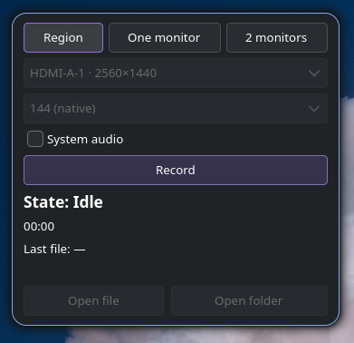
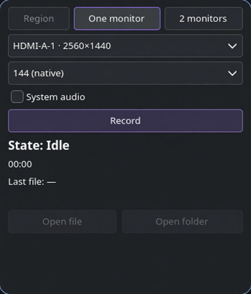

# Hyprcap

<p align="center">
  
</p>

<p align="center">
  <strong>Lightweight Rust + GTK4 screen recorder for Hyprland</strong><br/>
  libadwaita UI around <a href="https://github.com/ammen99/wf-recorder">wf-recorder</a>
</p>

| Mode | What it does |
|------|----------------|
| **Region** | Draw a rectangle, record that |
| **One monitor** | Full display + FPS picker |
| **2 monitors** | Both screens → **one** video (exactly 2 displays; layout matches Hyprland) |

CLI for keybinds. Files land in Videos; path is copied to the clipboard.

> **Initial release (v0.1).** Solid for daily recording on Hyprland, but early days — more is coming. Feedback and issues welcome.

**Planned / next ideas** (not a promise of order):

- Easier **keybind** setup (docs + helpers; maybe config-driven presets)
- More **quality / codec** options (`wf-recorder` / ffmpeg knobs)
- Polish for **2 monitors** (3+ still out of scope for now)
- Small UX extras as people use it

<p align="center">
  
  &nbsp;
  
</p>

---

## Install (Arch)

**AUR package name:** [`record-ui-git`](https://aur.archlinux.org/packages/record-ui-git)  
**Binary / brand:** `hyprcap` (this repo)

```bash
yay -S record-ui-git
# or:  paru -S record-ui-git
```

That installs hard deps (`wf-recorder`, `slurp`, `ffmpeg`, GTK, …), puts **`hyprcap`** on `PATH`, and registers the desktop entry (walker / app menu).

> **Name clash:** AUR packages [`hyprcap`](https://aur.archlinux.org/packages/hyprcap) / [`hyprcap-git`](https://aur.archlinux.org/packages/hyprcap-git) are a **different** project (bash helper for grim/wf-recorder). Do **not** install those expecting this app. Ours is only **`record-ui-git`** → `/usr/bin/hyprcap`.

```bash
yay -Sya              # if the AUR index is stale
yay -S record-ui-git
hyprcap               # GUI
# or search “Hyprcap” in walker
```

Optional keybind:

```conf
bind = SUPER SHIFT, A, exec, hyprcap toggle-region
```

---

## Use

| Want | Do |
|------|-----|
| GUI | `hyprcap` → mode → **Record** / **Stop** |
| Quick region | `hyprcap toggle-region` (again to stop) |
| One monitor (CLI) | `hyprcap fullscreen --output NAME --fps 60` |
| Both screens | GUI **2 monitors**, or `hyprcap both` |
| System audio (PC) | GUI **All PC sound**, or `--audio` / `--system all` |
| Mic | GUI **Microphone** (+ device), or `--mic` / `--mic-device NAME` |
| One app only | GUI **One app**, or `--system app --audio-app Spotify` |
| List outputs | `hyprcap list-outputs` |
| List audio devices | `hyprcap list-audio` |
| Quit session | `hyprcap quit` |

Audio is **off by default**. Mic + system sound are mixed into **one track**. App capture re-routes that app via PipeWire/Pulse for the session (you still hear it).

Closing the window **does not** stop a recording — use **Stop**.

**2 monitors** needs exactly two displays (detected live via `hyprctl`, not hardcoded). 3+ not supported yet.

---

## Config (optional)

`~/.config/hyprcap/config.toml` — also written when you change monitor/FPS in the GUI.

```toml
# output_dir = "/home/you/Videos"
# fullscreen_output = "DP-1"
# one_fps = 144
# audio_default = false          # legacy: true ≈ system all
# system_audio = "off"           # off | all | app
# audio_sink = ""                # empty = default sink
# audio_app = "Spotify"
# mic_default = false
# mic_device = ""                # empty = default input
```

> If you used the pre-rename `record-ui` builds: old config lived in `~/.config/record-ui/`. Copy settings over if needed.

---

## Build from source

```bash
cargo install --path . --locked
# → ~/.cargo/bin/hyprcap
# needs: rust, pkgconf, gtk4, libadwaita + runtime deps above
```

---

## License

MIT — [LICENSE](LICENSE).

Formerly known as **record-ui**. Internals (optional): [SPEC.md](SPEC.md) · [docs/DUAL-MONITOR.md](docs/DUAL-MONITOR.md) · [docs/brand/](docs/brand/)
